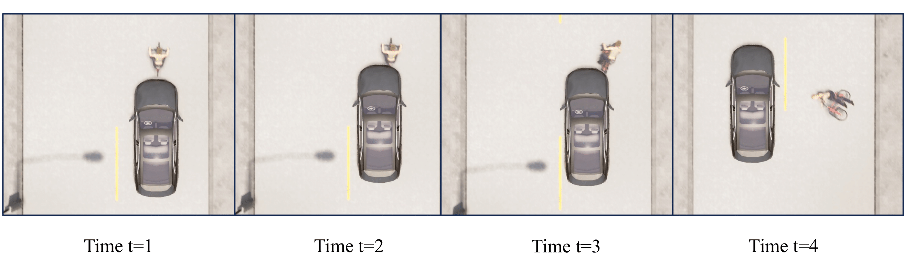
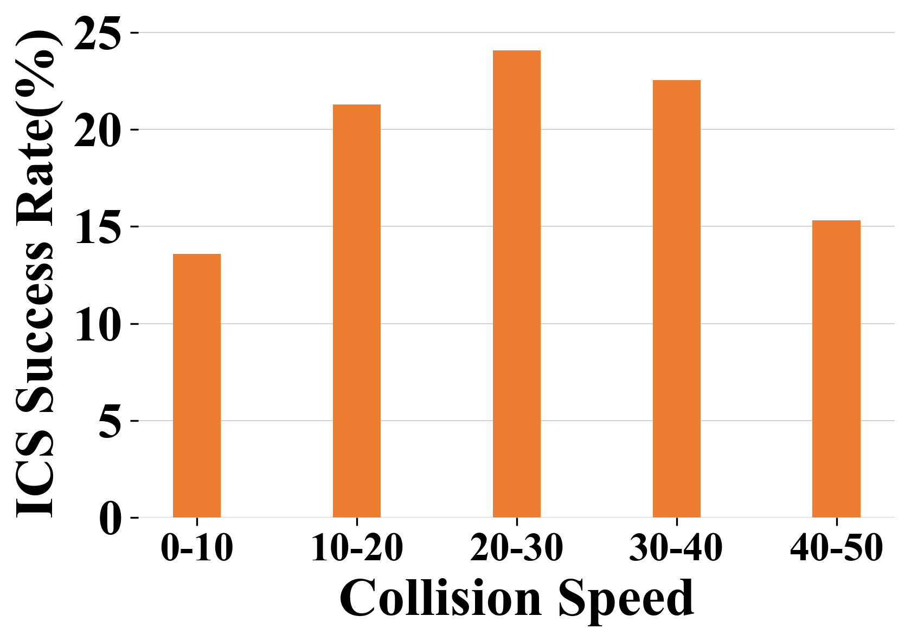
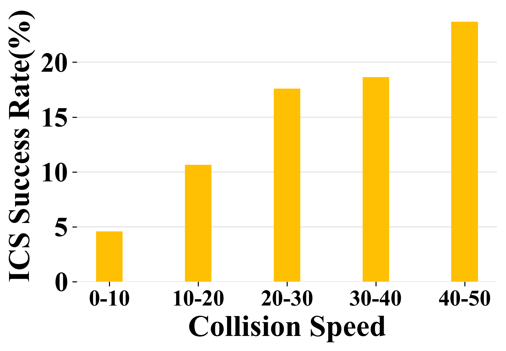
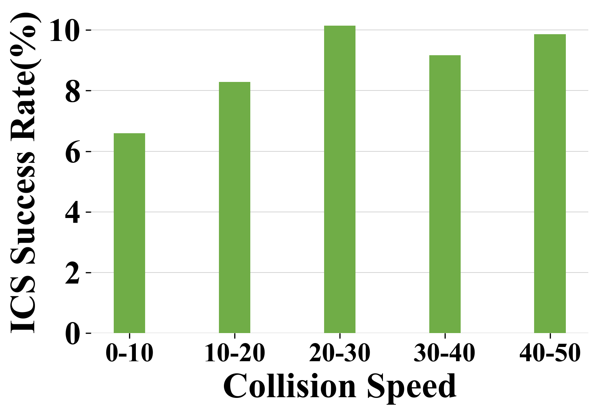
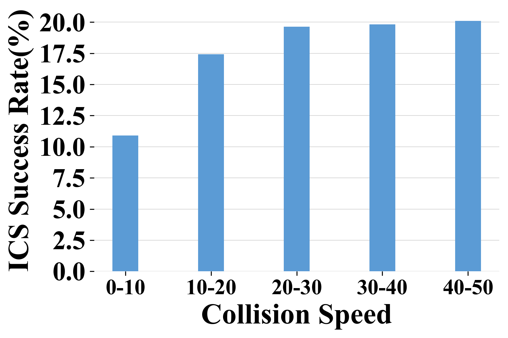
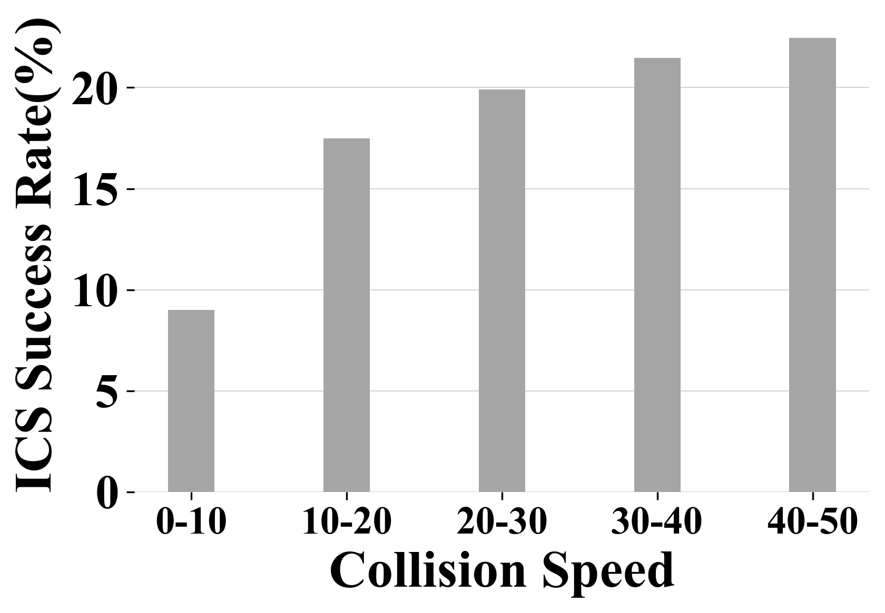

{% include note.html content="If you're cloning this theme, you're probably writing documentation of some kind. I have a blog on technical writing here called <a alt='technical writing blog' href='http://idratherbewriting.com'>I'd Rather Be Writing</a>. If you'd like to stay updated with the latest trends, best practices, and other methods for writing documentation, consider <a href='https://tinyletter.com/tomjoht'>subscribing</a>. I also have a site on <a href='http://idratherbewriting.com/learnapidoc'>writing API documentation</a>." %}


## Case Study


# ICSFuzz
The developer acknowledged the bug and claimed the partial fix.
The bug was also assigned a CVE ID, which will be updated after the paper review. 

|  #No.   | Scenario| Description | Bug Report | Video|
|  ----  | ----  | ----| --| --|
| ICS 01  |Follow Leading Bicycle | The left corner of vehicle collide with the bicycle, the motion state of bicycle significantly changed.| issues01:(https://github.com/carla-simulator/carla/issues/7025)| [Video](https://youtu.be/90UjwbenwmQ)
| ICS 02  | Follow Leading Bicycle | The head center of the vehicle hit the bicycle, sending it flying. | [issues02](https://github.com/carla-simulator/carla/issues/7025)|[Video](https://youtu.be/UP5NdyNeXls)
| ICS 03  | Follow Leading Vehicle | The left front corner of the rear vehicle hit the right rear corner of the front vehicle. | [issues03](https://github.com/carla-simulator/carla/issues/7025)|[Video](https://youtu.be/aSOXJVpqIEg)
| ICS 04  | Lane Change| The left front corner of the rear vehicle hit the right rear corner of the front vehicle. | [issues04](https://github.com/carla-simulator/carla/issues/7025)|[Video](https://youtu.be/SLZ7hAyEQ70)
| ICS 05  | Lane Change| The head of the rear vehicle scrape with the rear bumper of the front vehicle. | [issues05](https://github.com/carla-simulator/carla/issues/7025)|[Video](https://youtu.be/DfkYDoVsYQM)
| ICS 06  | Intersection Collision | The rear end of one vehicle scraped vertically against the left front corner of another vehicle's front end. | [issues06](https://github.com/carla-simulator/carla/issues/7025)|[Video](https://youtu.be/Pw8WLTboDt8)
| ICS 07  | Intersection Collision| The body of one vehicle scraped vertically against the front end of another vehicle as it passed by. | [issues07](https://github.com/carla-simulator/carla/issues/7025)|[Video](https://youtu.be/ClFrdoWaYvw)
| ICS 08  | Pedestrian Standing Front| The body of the vehicle grazed against the pedestrian as it drove by, knocking the pedestrian down. | [issues08](https://github.com/carla-simulator/carla/issues/7025)|[Video](https://youtu.be/sk1ajuxKcxI) 
| ICS 09  | Pedestrian Standing Front| The front bumper scraped the vehicle down. | [issues09](https://github.com/carla-simulator/carla/issues/7025)|[Video](https://youtu.be/3tkwENfjc_s)
| ICS 10  | Pedestrian Crossing Front| The rear of the vehicle knocked down the pedestrian who was in motion. | [issues10](https://github.com/carla-simulator/carla/issues/7025)|[Video](https://youtu.be/m1ujUC1OudI)

<!-- 

TODO:compare is click the issues better or directly provided the link


link: -->
<!-- 01
https://youtu.be/90UjwbenwmQ

02:
https://youtu.be/UP5NdyNeXls

03:
https://youtu.be/aSOXJVpqIEg

o4:
https://youtu.be/SLZ7hAyEQ70

05:
https://youtu.be/DfkYDoVsYQM


06
https://youtu.be/Pw8WLTboDt8

07
https://youtu.be/ClFrdoWaYvw

08
https://youtu.be/sk1ajuxKcxI

09
https://youtu.be/3tkwENfjc_s

10
https://youtu.be/m1ujUC1OudI


11
https://youtu.be/NrZlkHSTA5w
 -->


<!-- 

Carla issues we report:
https://github.com/carla-simulator/carla/issues/7025

the fixed issues:
https://github.com/carla-simulator/carla/pull/7445

TODO:
attach the particially fixed issue link at the beginning; together with the assigned cve id -->


TODO: Temp move the case study Section in paper here. Later need to supplement all the CASES; also paste the table in asyn repo here; remove the link on the subtitle



### ICS 01:
As shown in Figure~\ref{fig:case_study}, a clear collision occurred from \texttt{t2}, and the NPC bicycle was knocked down by the vehicle at \texttt{t3}. After the EV departs, the NPC bicycle falls to the ground (\texttt{t4}), resulting in significant damage. 
Notably, the collision detector failed to report the incident throughout the entire sequence.

### Safety Consequences:
If an ADS encounters this collision scenario during testing or development in the simulator, it may prevent the ADS developers from identifying and making necessary improvements to the system. Consequently, when the same ADS is deployed in the real world and encounters similar environmental conditions, it could make the same erroneous decision, potentially leading to a real collision with a cyclist. 
Such incidents could result in severe injuries or even fatalities for the cyclist. 

The potential consequences underscore the critical need for robust collision detection mechanisms in the simulator to ensure the safety and reliability of ADS during testing and development, ultimately safeguarding real-world applications.


## Empirical Study 
<!-- insert the studied tables -->

| **Crash Factors** | **Target** | **Values** |
| ----------------- | ---------- | ---------- |
| **Time**          | AV         | Daylight (43.75%), Dark (56.25%) [\cite{divergent_effect}] |
|                   |            | Daylight (67.3%), Unknown (32.7%) [\cite{avoid}] |
|                   |            | Daylight (64.52%), Dark street lights (33.33%), Dusk-dawn (2.15%) [\cite{analysis_poi}] |
|                   |            | Daylight (45%), Other (43%), Dark night (9%), Dusk-dawn (3%) [\cite{automated_latent}] |
|                   | Bicycle    | Good daytime lighting (46.4%), Poor daytime lighting (15.4%), Poor lighting at night (28.5%), Poor lighting at night (9.7%) [\cite{car-bicycle_analysis}] |
|                   |            | Daylight (52.2%), Dark (30.1%), Dusk or Dawn (17.8%) [\cite{single_bicycle_crash}] |
|                   |            | Daytime (77.2%), Nighttime w/ Lighting (18.3%), Nighttime wo/ Lighting (4.5%) [\cite{identifying_factors}] |
| **Collision Type**| AV         | Rear-end: (59.38%), Other (40.63%) [\cite{divergent_effect}] |
|                   |            | Front (25.7%), Left (25.1%), Rear (21.2%), Right (21%), Top (4.5%), Bottom (2.4%) [\cite{avoid}] |
|                   |            | Rear-end (64%), Sideswipe (15%), Broadside (12%), Head-on (12%) [\cite{analysis_poi}] |
|                   |            | Rear-end (61.1%), Sideswipe (24.8%), Other (6.2%), Broadside (5.3%), Head-on (2.7%) [\cite{exploratory_cal}] |
|                   |            | Rear-end (49.85%), Sideswipe (20.64%), Head-on (10.86%), Broadside (6.57%), Bike/Pedestrian (6.7%), Hit object (5.81%) [\cite{learn_crash}] |
|                   |            | Other (45%), Rear-end (38%), Sideswipe (11%), Head-on (3%), Hit-object (3%) [\cite{automated_latent}] |
|                   | Pedestrian | Frontal impact (43.8%), Side impact (24.1%), Car moving forward (23.2%), Back (6.2%), No impact (3.6%) [\cite{typical_pedestrian}] |
|                   | Bicycle    | For bicycle: Side (54.7%), Frontal (19.9%), Scrape (14.2%), Rear-end (8.2%), Others (3%), For vehicle: Left hood (24.3%), Frontal hood (17.6%), Right hood (26.7%), Left back (4.1%), Back (3%), Right back (2.6%), Left body (9.7%), Right body (12%) [\cite{car-bicycle_analysis}] |
|                   |            | Front (64.4%), Right (19.4%), Left (10.6%), Rear (5.6%) [\cite{identifying_factors}] |
| **Speed**         | AV         | ≤25mph (88.54%), >25mph (21.88%) [\cite{divergent_effect}] |
|                   |            | [0,15] (31.8%), [15,30] (17.3%), [30,45] (16.2%), [45,60] (16.2%), [60,75] (15%), [75,90] (2.9%), [90,105] (0.6%) m/s [\cite{avoid}] |
|                   | Pedestrian | 2-10m/s (50.8%), 10-20m/s (42.9%), 20-30m/s (5.9%), >30m/s (0.5%) [\cite{pedestrian_causation}] |
|                   | Bicycle    | Speeding (33.1%) [\cite{car-bicycle_analysis}] |
| **Weather**       | AV         | Clear weather (88.54%), Cloudy (5.21%), Raining (3.13%), Fog/Visibility (2.08%) [\cite{divergent_effect}] |
|                   |            | Clear (77.42%), Cloudy (19.35%), Raining (12.15%), Fog (1.08%) [\cite{analysis_poi}] |
|                   |            | Clear (48%), Other (44%), Cloudy (5%), Raining (2%), Fog (1%) [\cite{automated_latent}] |
|                   | Bicycle    | Sunny (70.87%), Rain (15.72%), Fog (7.11%), Snow (2.6%), Rain (3.7%) [\cite{car-bicycle_analysis}] |
|                   |            | Clear (68.9%), Rain/Snow/Fog (16.7%), Cloudy (14.4%) [\cite{identifying_factors}] |
|                   |            | Visibility fine (82.8%), Visibility reduced (14.9%), Other (2.3%) [\cite{single_bicycle_crash}] |
| **Accident Location** | AV     | Road Type: Intersection (65.63%), Street Width: ≤60 feet (78.13%), Trees: 80.21% [\cite{divergent_effect}] |
|                   |            | Highway/Freeway (32.0%), Unknown (37.6%), Intersection (13.6%), Street (13.4%), Rural road (2.2%), Parking lot (1.3%) [\cite{avoid}] |
|                   |            | Intersection (47.31%), Street (35.48%), Highway (13.98%), Parking lot (3.23%) [\cite{analysis_poi}] |
|                   |            | Intersection (73.5%) [\cite{exploratory_cal}] |
|                   |            | Intersections (69.72%), Street (21.71%), Expressway (4.74%) [\cite{learn_crash}] |
|                   | Bicycle    | Road Type: Straight road (23.9%), Ramp (9.4%), Four-leg intersection (45.6%), Three-leg intersection (21.1%), Single-lane (5.6%), Two-lane two-way (7.8%), Four-lane two-way (24.4%), Six-lane, two-way (62.2%), Road condition: Dry (78.9%), Wet (16.7%), Water (4.4%) [\cite{identifying_factors}] |
|                   |            | Urban (79%), Rural (21%), Road condition: Dry road surface (31%), Slippery (49.6%), Wet (18.9%) [\cite{single_bicycle_crash}] |
| **Vehicle State** | AV         | Straight (87.50%), Turning movement (12.50%) [\cite{divergent_effect}] |
|                   |            | Other (36.63%), Proceeding straight (20.89%), Unknown (19.89%), Left turn (4.95%), Changing lanes (4.41%), Right turn (1.98%), Backing (1.89%) [\cite{avoid}] |
|                   |            | Stopped (36.08%), Proceeding straight (29.9%), Right turn (5.15%), Slowing/Stopping (10.31%), Left turn (4.12%), Changing lanes (4.12%), Parking maneuver (2.06%) [\cite{analysis_poi}] |
|                   |            | Left turn (11.5%), Right turn (21.2%), No turning (66.3%) [\cite{exploratory_cal}] |
|                   |            | Other (44.64%), Stopped (23.21%), Straight (15.18%), Left turn (3.57%), Right turn (2.68%) [\cite{automated_latent}] |
|                   | Pedestrian | Vehicle moving forwards (99.11%), Parked or reversing (0.89%) [\cite{typical_pedestrian}] |
| **Collide With**  | AV         | Non-motor vehicles or pedestrians involved (18.75%) [\cite{divergent_effect}] |
|                   | Pedestrian | Car/taxi (90.88%), Motorcycle (3.97%), Bus (5.97%), Light goods vehicle (1.95%), Other (2.09%), Pedal cycle (1.48%), Unknown vehicle (0.06%) [\cite{typical_pedestrian}] |
| **# of Vehicles** | AV         | 2 (87.50%), 1 (11.46%), 3 (1.04%) [\cite{divergent_effect}] |
|                   |            | 2 (90.3%), 1 (8%), 3 (1.8%) [\cite{exploratory_cal}] |
|                   |            | 2 (84.16%), 1 (12.87%), Multi (1.


## Single Factors 
TODO: polish the format and the word


<!-- 






 -->


## Build the Theme

Follow these instructions to build the theme.

### 1. Download the theme

First, download or clone the theme from the [Github repo](https://github.com/tomjoht/documentation-theme-jekyll). Most likely you won't be pulling in updates once you start customizing the theme, so downloading the theme (instead of cloning it) probably makes the most sense. In Github, click the **Clone or download** button, and then click **Download ZIP**.

### 2. Install Jekyll

If you've never installed or run a Jekyll site locally on your computer, follow these instructions to install Jekyll:

* [Install Jekyll on Mac][mydoc_install_jekyll_on_mac]
* [Install Jekyll on Windows][mydoc_install_jekyll_on_windows]

### 3. Install Bundler

In case you haven't installed Bundler, install it:

```
gem install bundler
```

You'll want [Bundler](http://bundler.io/) to make sure all the Ruby gems needed work well with your project. Bundler sorts out dependencies and installs missing gems or matches up gems with the right versions based on gem dependencies.

### 4. Option 1: Build the Theme (*without* the github-pages gem) {#option1}

Use this option if you're not planning to publish your Jekyll site using [Github Pages](https://pages.github.com/).

Bundler's Gemfile specifies how project dependencies are managed. Although this project includes a Gemfile, this theme doesn't have any dependencies beyond core Jekyll. The Gemfile is used to list gems needed for publishing on Github Pages. **If you're not planning to have Github Pages build your Jekyll project, delete these two files from the theme's root directory:**

* Gemfile
* Gemfile.lock

If you've never run Jekyll on your computer (you can check with `jekyll --version`), you may need to install the jekyll gem:

```
gem install jekyll
```

Now run jekyll serve (first change directories (`cd`) to where you downloaded the project):

```
jekyll serve
```

### 4. Option 2: Build the Theme (*with* the github-pages gem) {#option2}

If you *are* in fact publishing on Github Pages, leave the Gemfile and Gemfile.lock files in the theme.The Gemfile tells Jekyll to use the github-pages gem. **However, note that you cannot use the normal `jekyll serve` command with this gem due to dependency conflicts between the latest version of Jekyll and Github Pages** (which are noted [briefly here](https://help.github.com/articles/setting-up-your-github-pages-site-locally-with-jekyll/)).

You need Bundler to resolve these dependency conflicts. Use Bundler to install all the needed Ruby gems:

```
bundle update
```

Then *always* use this command to build Jekyll:

```
bundle exec jekyll serve
```

If you want to shorten this long command, you can put this code in a file such as jekyll.sh (on a Mac) and then simply type `. jekyll.sh` to build Jekyll.

## Running the site in Docker

You can also use Docker to directly build and run the site on your local machine. Just clone the repo and run the following from your working dir:
```
docker-compose build --no-cache && docker-compose up
```
The site should now be running at [http://localhost:4000/](http://localhost:4000/).

This is perhaps the easiest way to see how your site would actually look.

## Configure the sidebar

There are several products in this theme. Each product uses a different sidebar. This is the essence of what makes this theme unique -- different sidebars for different product documentation. The idea is that when users are reading documentation for a specific product, the sidebar navigation should be specific to that product. (You can read more of my thoughts on why multiple sidebars are important in this [blog post](http://idratherbewriting.com/2016/03/23/release-of-documentation-theme-for-jekyll-50/).)

The top navigation usually remains the same, because it allows users to navigate across products. But the sidebar navigation adapts to the product.

In each page's frontmatter, you must specify the sidebar you want that page to use. Here's an example of the page frontmatter showing the sidebar property:

<pre>
---
title: Alerts
tags: [formatting]
keywords: notes, tips, cautions, warnings, admonitions
last_updated: July 3, 2016
summary: "You can insert notes, tips, warnings, and important alerts in your content. These notes are stored as shortcodes made available through the linksrefs.hmtl include."
<span class="red">sidebar: mydoc_sidebar</span>
permalink: mydoc_alerts
---
</pre>

The `sidebar: mydoc_sidebar` refers to the \_data/sidebars/mydoc_sidebar.yml file.

Note that your sidebar can only have 2 levels (expand the **Tag archives** option to see an example of the second level). Given that each product has its own sidebar, this depth should be sufficient (it's really like 3 levels). Deeper nesting goes against usability recommendations.

You can optionally turn off the sidebar on any page (e.g. landing pages). To turn off the sidebar for a page, you should set the page frontmatter tag as `hide_sidebar: true`.

If you don't declare a sidebar, the `home_sidebar` file gets used as the default because this is the default specified in the config file:

```yaml
-
  scope:
    path: ""
    type: "pages"
  values:
    layout: "page"
    comments: true
    search: true
    sidebar: home_sidebar
    topnav: topnav
```

If you want to set different sidebar defaults based on different folders for your pages, specify your defaults like this:

```
-
  scope:
    path: "pages/mydoc"
    type: "pages"
  values:
    layout: "page"
    comments: true
    search: true
    sidebar: mydoc_sidebar
    topnav: topnav
```

This would load the `mydoc_sidebar` for each file in **pages/mydoc**. You could set different defaults for different path scopes.

For more detail on the sidebar, see [Sidebar navigation][mydoc_sidebar_navigation].

## Top navigation

The top navigation works just like the sidebar. You can specify which topnav data file should load by adding a `topnav` property in your page, like this:

```yaml
topnav: topnav
```

Here the topnav refers to the `_data/topnav.yml` file.

Because most topnav options will be the same, the `_config.yml` file specifies the topnav file as a default:

```yaml
-
  scope:
    path: ""
    type: "pages"
  values:
    layout: "page"
    comments: true
    search: true
    sidebar: home_sidebar
    topnav: topnav
```

## Sidebar syntax

The sidebar data file uses a specific YAML syntax that you must follow. Follow the sample pattern shown in the theme, specically looking at `mydoc_sidebar.yml` as an example: Here's a code sample showing all levels:

```yaml
entries:
- title: sidebar
  product: Jekyll Doc Theme
  version: 6.0
  folders:
  - title: Overview
    output: web, pdf
    folderitems:

    - title: Get started
      url: /index.html
      output: web, pdf
      type: homepage

    - title: Introduction
      url: /mydoc_introduction.html
      output: web, pdf

  - title: Release Notes
    output: web, pdf
    folderitems:

    - title: 6.0 Release notes
      url: /mydoc_release_notes_60.html
      output: web, pdf

    - title: 5.0 Release notes
      url: /mydoc_release_notes_50.html
      output: web, pdf

  - title: Tag archives
    output: web
    folderitems:

    - title: Tag archives overview
      url: /mydoc_tag_archives_overview.html
      output: web

      subfolders:
      - title: Tag archive pages
        output: web
        subfolderitems:

        - title: Formatting pages
          url: /tag_formatting.html
          output: web

        - title: Navigation pages
          url: /tag_navigation.html
          output: web

        - title: Content types pages
          url: /tag_content_types.html
          output: web
```

Each `folder` or `subfolder` must contain a `title` and `output` property. Each `folderitem` or `subfolderitem` must contain a `title`, `url`, and `output` property.

The two outputs available are `web` and `pdf`. (Even if you aren't publishing PDF, you still need to specify `output: web`).

The YAML syntax depends on exact spacing, so make sure you follow the pattern shown in the sample sidebars. See my [YAML tutorial](mydoc_yaml_tutorial) for more details about how YAML works.



Each level must have at least one topic before the next level starts. You can't have a second level that contains multiple third levels without having at least one standalone topic in the second level. If you need a hierarchy that has a folder that contains other folders and no loose topics, use a blank `-` item like this:

```yaml
entries:
- title: sidebar
  product: Jekyll Doc Theme
  version: 6.0
  folders:
  - title: Overview
    output: web, pdf
    folderitems:

    -

  - title: Release Notes
    output: web, pdf
    folderitems:

    - title: 6.0 Release notes
      url: /mydoc_release_notes_60.html
      output: web, pdf

    - title: 5.0 Release notes
      url: /mydoc_release_notes_50.html
      output: web, pdf

  - title: Installation
    output: web, pdf
    folderitems:

    - title: About Ruby, Gems, Bundler, etc.
      url: /mydoc_about_ruby_gems_etc.html
      output: web, pdf

    - title: Install Jekyll on Mac
      url: /mydoc_install_jekyll_on_mac.html
      output: web, pdf

    - title: Install Jekyll on Windows
      url: /mydoc_install_jekyll_on_windows.html
      output: web, pdf
```

To accommodate the title page and table of contents in PDF outputs, each product sidebar must list these pages before any other:

```yaml
- title:
  output: pdf
  type: frontmatter
  folderitems:
  - title:
    url: /titlepage
    output: pdf
    type: frontmatter
  - title:
    url: /tocpage
    output: pdf
    type: frontmatter
```

Leave the output as `output: pdf` for these frontmatter pages so that they don't appear in the web output.

For more detail on the sidebar, see [Sidebar navigation][mydoc_sidebar_navigation] and [YAML tutorial][mydoc_yaml_tutorial].

## Comments

The theme integrates [Commento.io](https://commento.io/) for comments below pages and posts. (This commenting service doesn't inject controversial tracking ads like Disqus does.) You will need to Commento.io account + plan ($5/month) to authorize Commento with your domain (no other configuration should be required). If you don't want comments, in the \_config.yml file, change the `comments: true` properties (under `defaults`) to `comments: false` in every instance. Then in the commento.html include file (inside \_includes), the ` ... ` logic will not insert the Commentio form.

## Relative links and offline viewing

This theme uses relative links throughout so that you can view the site offline and not worry about which server or directory you're hosting it. It's common with tech docs to push content to an internal server for review prior to pushing the content to an external server for publication. Because of the need for seamless transferrence from one host to another, the site has to use relative links.

To view pages locally on your machine (without the Jekyll preview server), they need to have the `.html` extension. The `permalink` property in the page's frontmatter (without surrounding slashes) is what pushes the files into the root directory when the site builds.

## Page frontmatter

When you write pages, include these same frontmatter properties with each page:

```yaml
---
title: "Some title"
tags: [sample1, sample2]
keywords: keyword1, keyword2, keyword3
last_updated: Month day, year
summary: "optional summary here"
sidebar: sidebarname
permalink: filename.html
---
```

(You will customize the values for each of these properties, of course.)

For titles, surrounding the title in quotes is optional, but if you have a colon in the title, you must surround the title with quotation marks. If you have a quotation mark inside the title, escape it first with a backlash `\`.

Values for `keywords` get populated into the metadata of the page for SEO.

Values for `tags` must be defined in your \_data/tags.yml list. You also need a corresponding tag file inside the tags folder pages/tags/ that follows the same pattern as the other tag files shown in the tags folder. (Jekyll won't auto-create these tag files.)

If you don't want the mini-TOC to show on a page (such as for the homepage or landing pages), add `toc: false` in the frontmatter.

The `permalink` value should be the same as your filename and include the ".html" file extension.

For more detail, see [Pages][mydoc_pages].

## Where to store your documentation topics

You can store your files for each product inside subfolders following the pattern shown in the theme. For example, product1, product2, etc, can be stored in their own subfolders inside the \_pages directory. Inside \_pages, you can store your topics inside sub-subfolders or sub-sub-folders to your heart's content. When Jekyll builds your site, it will pull the topics into the root directory and use the permalink for the URL.

Note that product1, product2, and mydoc are all just sample content to demonstrate how to add multiple products into the theme. You can freely delete that content.

For more information, see [Pages][mydoc_pages] and [Posts][mydoc_posts].

## Configure the top navigation

The top navigation bar's menu items are set through the \_data/topnav.yml file. Use the top navigation bar to provide links for navigating from one product to another, or to navigate to external resources.

For external URLs, use `external_url` in the item property, as shown in the example topnav.yml file. For internal links, use `url` the same was you do in the sidebar data files.

Note that the topnav has two sections: `topnav` and `topnav_dropdowns`. The topnav section contains single links, while the `topnav_dropdowns` section contains dropdown menus. The two sections are independent of each other.

## Generating PDF

If you want to generate PDF, you'll need a license for [Prince XML](http://www.princexml.com/). You will also need to [install Prince](http://www.princexml.com/doc/installing/).  You can generate PDFs by product (but not for every product on the site combined together into one massive PDF). Prince will work even without a license, but it will imprint a small Prince image on the first page, and you're supposed to buy the license to use it.

If you're on Windows, install [Git Bash client](https://git-for-windows.github.io/) rather than using the default Windows command prompt.

Open up the css/printstyles.css file and customize the email address (`youremail@domain.com`) that is listed there. This email address appears in the bottom left footer of the PDF output. You'll also need to create a PDF configuration file following the examples shown in the pdfconfigs folder, and also customize some build scripts following the same pattern shown in the root: pdf-product1.sh

See the section on [Generating PDFs][mydoc_generating_pdfs] for more details about setting the theme up for this output.

## Blogs / News

For blog posts, create your markdown files in the \_posts folder following the sample formats. Post file names always begin with the date (YYYY-MM-DD-title).

The news/news.html file displays the posts, and the news_archive.html file shows a yearly history of posts. In documentation, you might use the news to highlight product features outside of your documentation, or to provide release notes and other updates.

See [Posts][mydoc_posts] for more information.

## Markdown

This theme uses [kramdown markdown](http://kramdown.gettalong.org/). kramdown is similar to Github-flavored Markdown, except that when you have text that intercepts list items, the spacing of the intercepting text must align with the spacing of the first character after the space of a numbered list item. Basically, with your list item numbering, use two spaces after the dot in the number, like this:

```
1.  First item
2.  Second item
3.  Third item
```

When you want to insert paragraphs, notes, code snippets, or other matter in between the list items, use four spaces to indent. The four spaces will line up with the first letter of the list item (the <b>F</b>irst or <b>S</b>econd or <b>T</b>hird).

```
1.  First item

    ```
    alert("hello");
    ```

2.  Second item

    Some pig!

3.  Third item
```

See the topics under "Formatting" in the sidebar for more information.

## Automated links

If you want to use an automated system for managing links, see [Automated Links][mydoc_hyperlinks.html#automatedlinks]. This approach automatically creates a list of Markdown references to simplify linking.

## Other instructions

The content here is just a getting started guide only. For other details in working with the theme, see the various sections in the sidebar.


